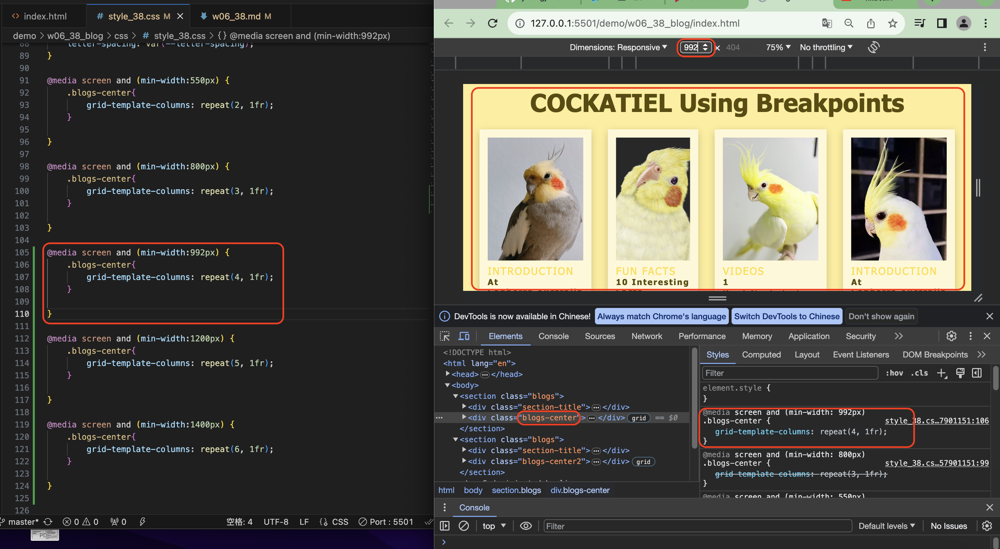
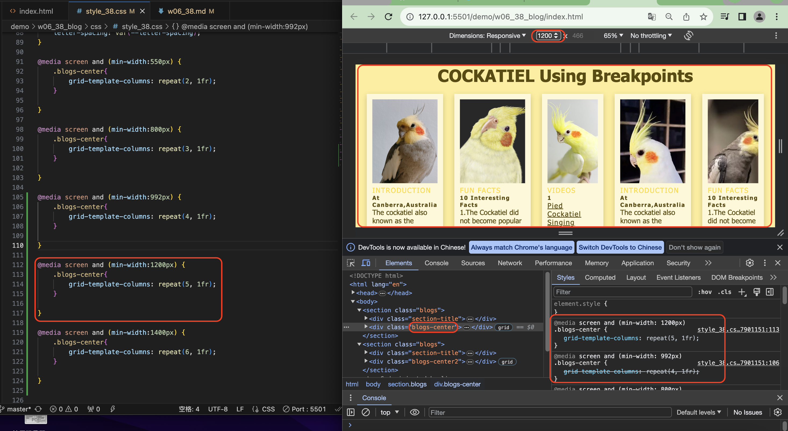
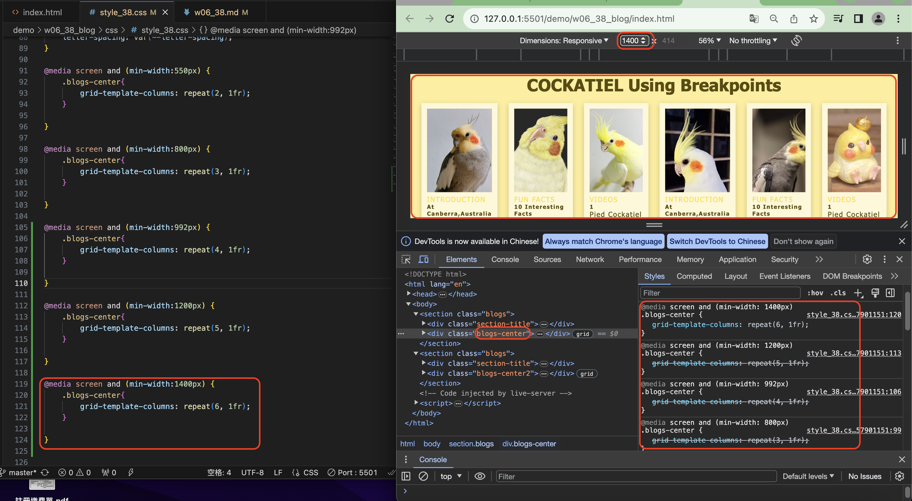
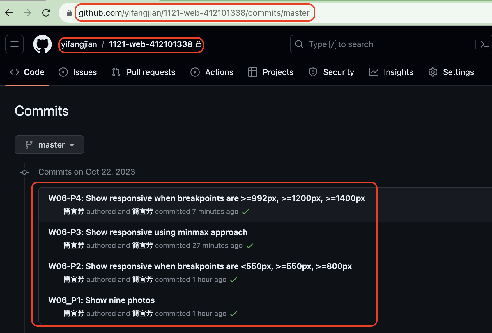

gi[My Github Repo](https://github.com/yifangjian/1121-web-412101338)

### W06_P1: Show nine photos


```
e2c0374 簡宜芳  Sun Oct 22 13:38:16 2023 +0800         W06_P1: Show nine photos
```


### W06-P2: Show responsive when breakpoints are <550px, >=550px, >=800px


```
1eada8a 簡宜芳  Sun Oct 22 14:10:59 2023 +0800  W06-P2: Show responsive when breakpoints are <550px, >=550px, >=800px
```


### W06-P3: Show responsive using minmax approach


```
63fede7 簡宜芳  Sun Oct 22 14:49:20 2023 +0800  W06-P3: Show responsive using minmax approach
```


### W06-P4: Show responsive when breakpoints are >=992px, >=1200px, >=1400px







```
8de272b 簡宜芳  Sun Oct 22 15:09:30 2023 +0800  W06-P4: Show responsive when breakpoints are >=992px, >=1200px, >=1400px
```


### W06-P5: W06 git logs



```
git log --pretty=format:"%h%x09%an%x09%ad%x09%s" --after="2023-10-21"
8de272b 簡宜芳  Sun Oct 22 15:09:30 2023 +0800  W06-P4: Show responsive when breakpoints are >=992px, >=1200px, >=1400px
63fede7 簡宜芳  Sun Oct 22 14:49:20 2023 +0800  W06-P3: Show responsive using minmax approach
1eada8a 簡宜芳  Sun Oct 22 14:10:59 2023 +0800  W06-P2: Show responsive when breakpoints are <550px, >=550px, >=800px
e2c0374 簡宜芳  Sun Oct 22 13:38:16 2023 +0800  W06_P1: Show nine photos
```