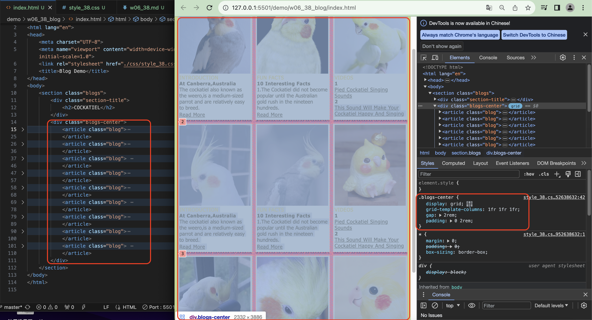
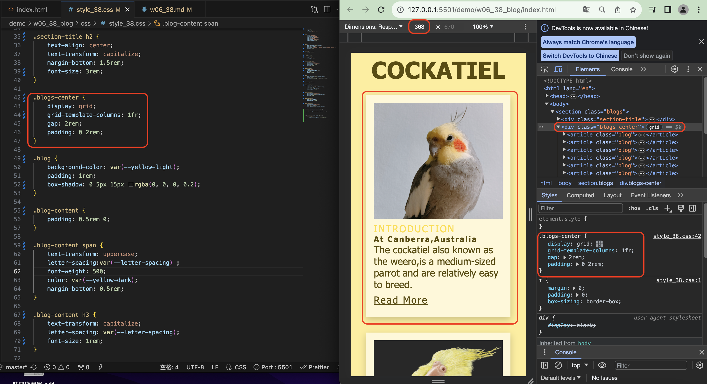
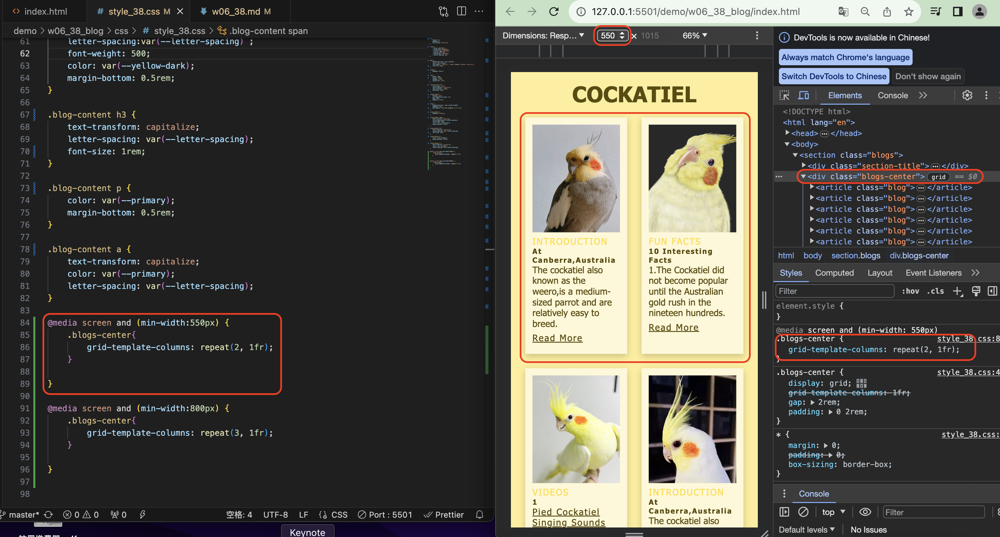
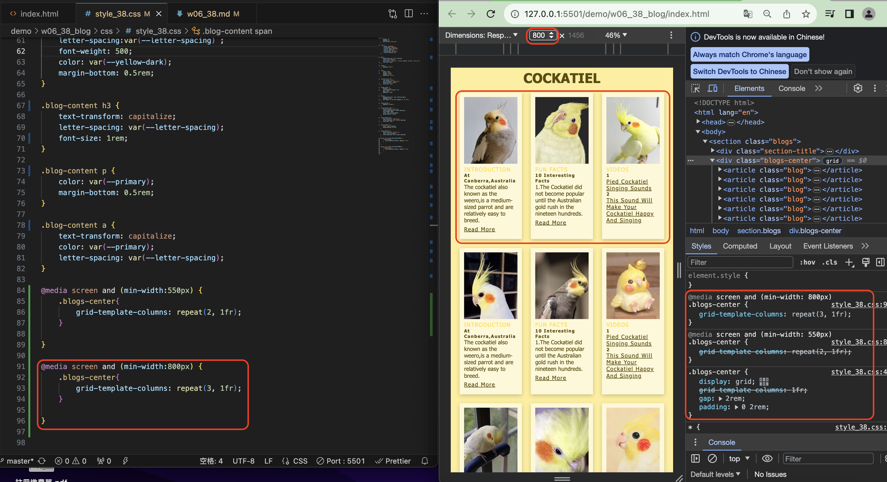
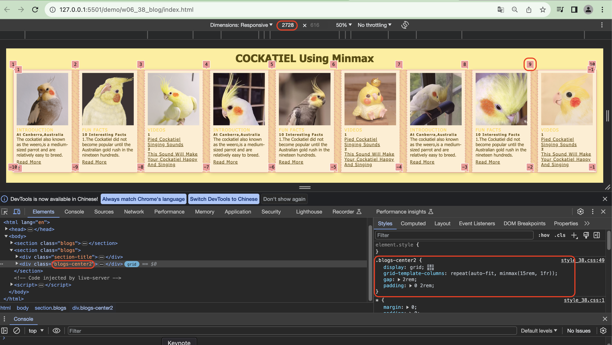
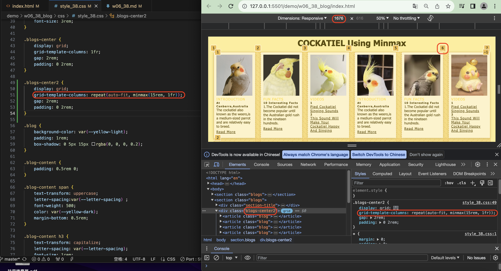
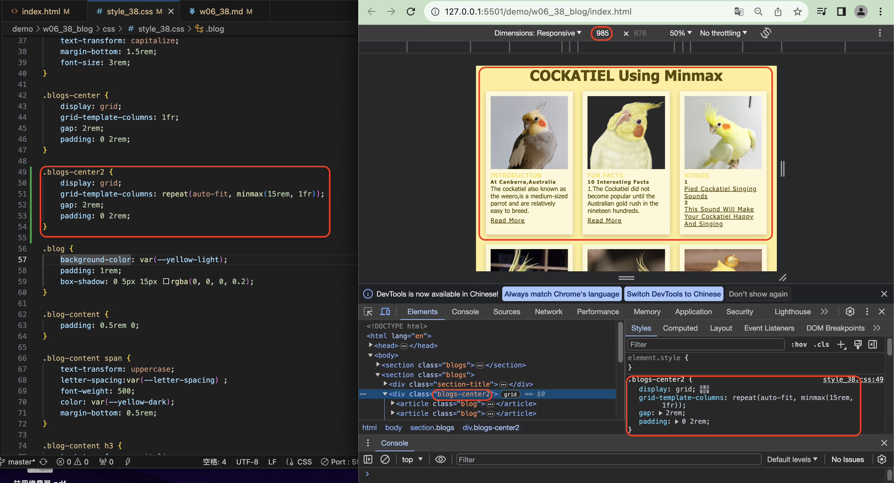
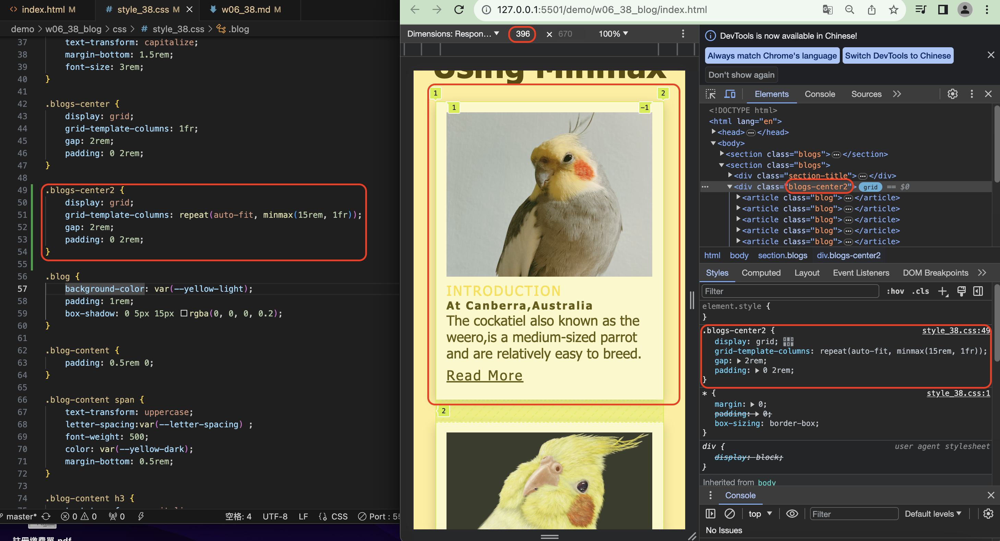

[My Github Repo](https://github.com/yifangjian/1121-web-412101338)

### W06_P1: Show nine photos



```
e2c0374 簡宜芳  Sun Oct 22 13:38:16 2023 +0800         W06_P1: Show nine photos
```


### W06-P2: Show responsive when breakpoints are <550px, >=550px, >=800px







```
1eada8a 簡宜芳  Sun Oct 22 14:10:59 2023 +0800  W06-P2: Show responsive when breakpoints are <550px, >=550px, >=800px
```


### W06-P3: Show responsive using minmax approach









```

```


### W06-P3: W06 git logs


```
$ git log --pretty=format:"%h%x09%an%x09%ad%x09%s" --after="2023-10-11"
cc1afe2 簡宜芳  Thu Oct 12 21:13:50 2023 +0800  W05-P2: Show 3 photos in a row,containing all css in a blog article
625d15a 簡宜芳  Thu Oct 12 21:10:33 2023 +0800  W05_P1:Use css grid to show 2 photos in a row
```