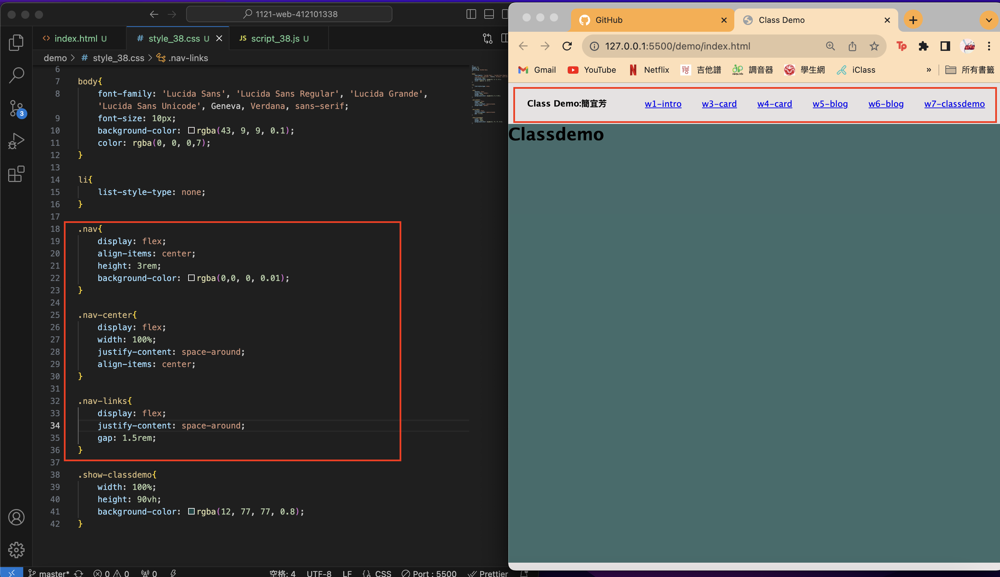
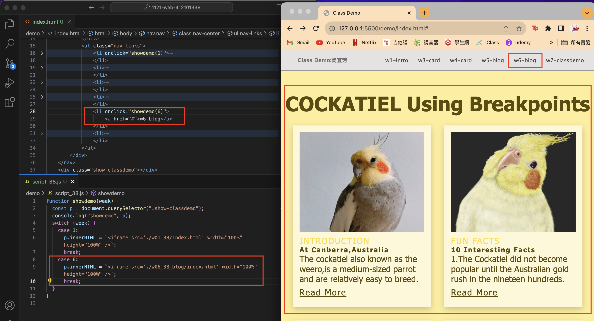
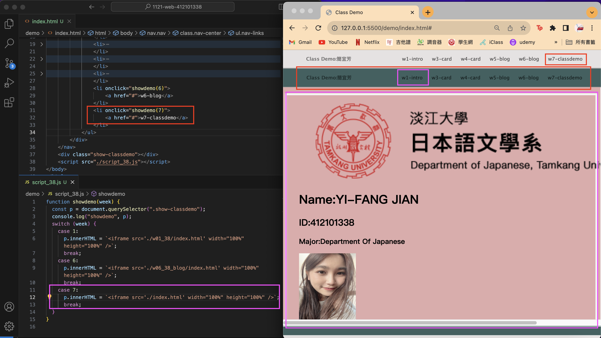
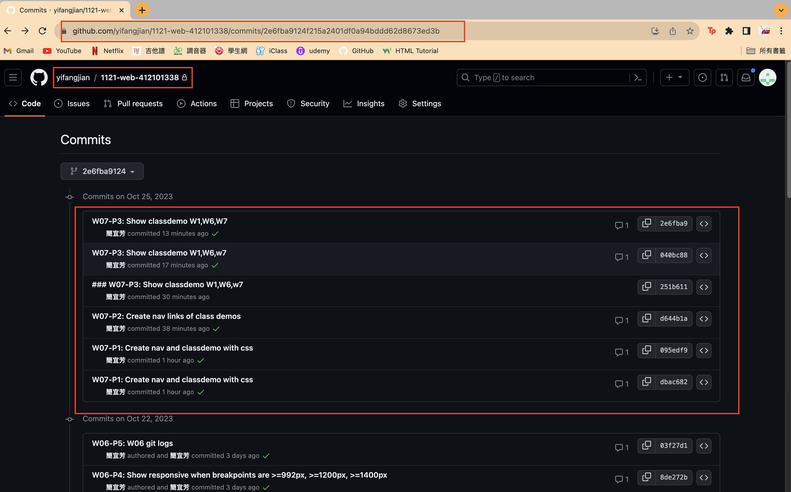

[My Github Repo](https://github.com/yifangjian/1121-web-412101338)

### W07-P1: Create nav and classdemo with css


```
95edf9 簡宜芳  Wed Oct 25 16:47:07 2023 +0800  W07-P1: Create nav and classdemo with css 
```

### W07-P2: Create nav links of class demos



```
d644b1a 簡宜芳  Wed Oct 25 17:13:08 2023 +0800  W07-P2: Create nav links of class demos
```

### W07-P3: Show classdemo W1,W6,W7




```
e53b9b5 簡宜芳  Wed Oct 25 17:45:25 2023 +0800  W07-P3: Show classdemo W1,W6,W7
```

### W07-P4: W7 git logs



```
git log --pretty=format:"%h%x09%an%x09%ad%x09%s" --after="2023-10-24"
c2dabe8 簡宜芳  Wed Oct 25 17:56:20 2023 +0800  W04-P4: W7 git logs
e53b9b5 簡宜芳  Wed Oct 25 17:45:25 2023 +0800  W07-P3: Show classdemo W1,W6,W7
2e6fba9 簡宜芳  Wed Oct 25 17:38:01 2023 +0800  W07-P3: Show classdemo W1,W6,W7
040bc88 簡宜芳  Wed Oct 25 17:34:49 2023 +0800  W07-P3: Show classdemo W1,W6,w7
251b611 簡宜芳  Wed Oct 25 17:21:49 2023 +0800  ### W07-P3: Show classdemo W1,W6,w7
d644b1a 簡宜芳  Wed Oct 25 17:13:08 2023 +0800  W07-P2: Create nav links of class demos
095edf9 簡宜芳  Wed Oct 25 16:47:07 2023 +0800  W07-P1: Create nav and classdemo with css
dbac682 簡宜芳  Wed Oct 25 16:41:46 2023 +0800  W07-P1: Create nav and classdemo with css
```