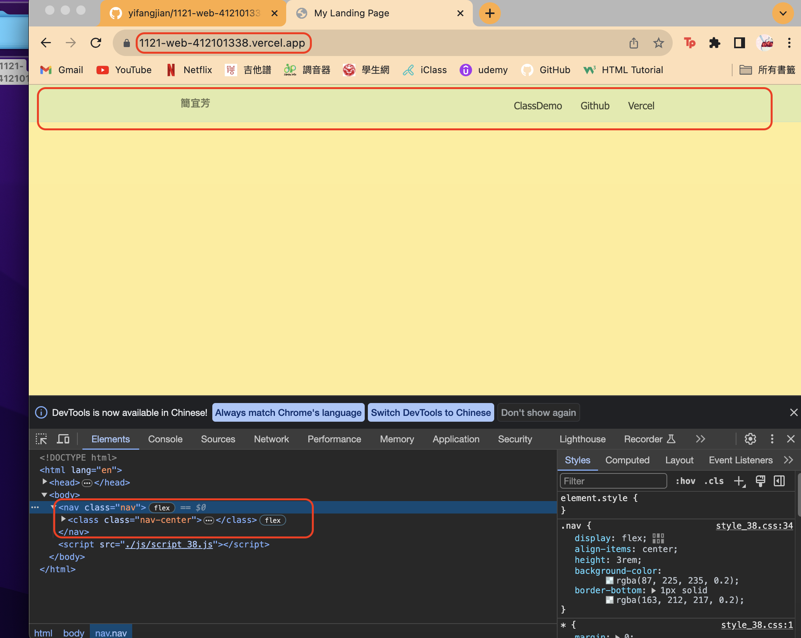

[My Github Repo](https://github.com/yifangjian/1121-web-412101338)

### W08-P1: Show the section of #section-blogs-minmax with navbar-fixed css


```
105f1de 簡宜芳  Sat Nov 4 11:48:53 2023 +0800   W08-P1: Show the section of #section-blogs-minmax with navbar-fixed css 
```

### W08-P2: Use Javascript to create a fixed navbar when mouse moves down to some extent, and removes when original nav appears


```
c182bae 簡宜芳  Sat Nov 4 12:08:37 2023 +0800   W08-P2: Use Javascript to create a fixed navbar when mouse moves down to some extent, and removes when original nav appears
```

### W08-P3: Create index.html of my landing page



```
8e86d29 簡宜芳  Sat Nov 4 12:38:30 2023 +0800   update w08-p3
c5427ec 簡宜芳  Sat Nov 4 12:31:26 2023 +0800   W08-P3: Create index.html of my landing page
```

### W08-P4: W08 git logs


```
% git log --pretty=format:"%h%x09%an%x09%ad%x09%s" --after="2023-11-01"
8e86d29 簡宜芳  Sat Nov 4 12:38:30 2023 +0800   update w08-p3
c5427ec 簡宜芳  Sat Nov 4 12:31:26 2023 +0800   W08-P3: Create index.html of my landing page
c182bae 簡宜芳  Sat Nov 4 12:08:37 2023 +0800   W08-P2: Use Javascript to create a fixed navbar when mouse moves down to some extent, and removes when original nav appears
105f1de 簡宜芳  Sat Nov 4 11:48:53 2023 +0800   W08-P1: Show the section of #section-blogs-minmax with navbar-fixed css
```