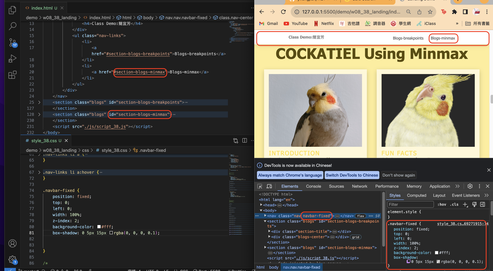
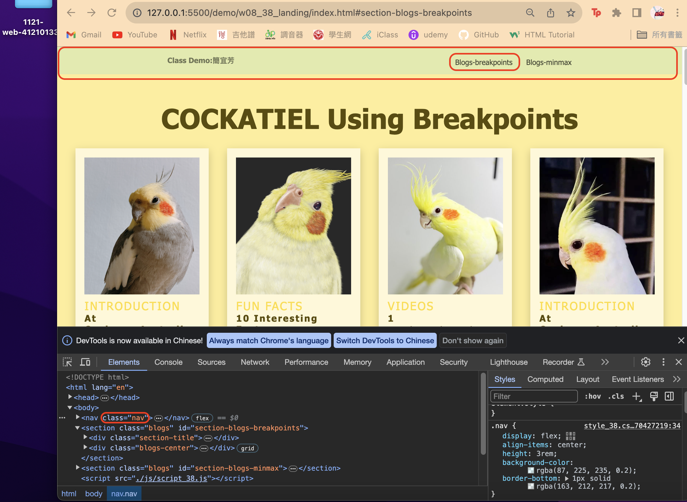
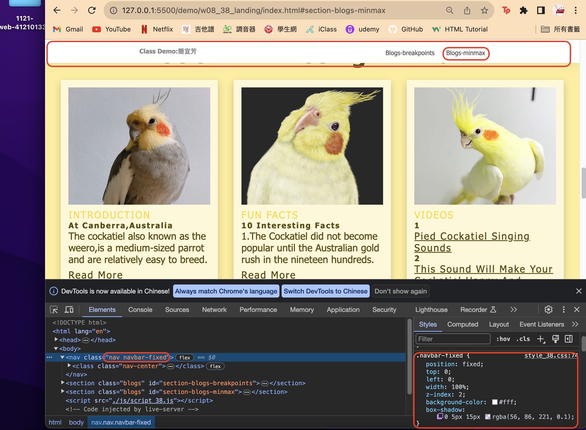
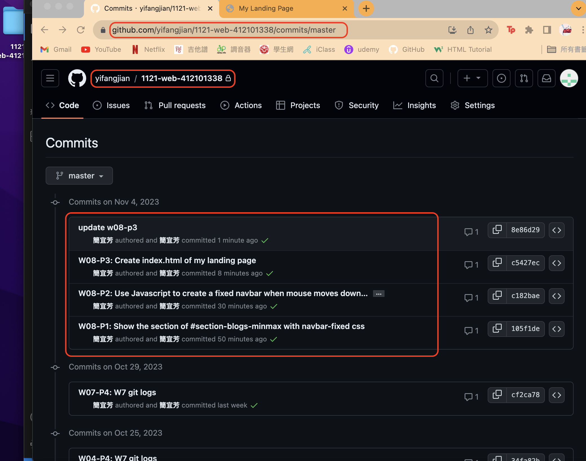

[My Github Repo](https://github.com/yifangjian/1121-web-412101338)

### W08-P1: Show the section of #section-blogs-minmax with navbar-fixed css



```
105f1de 簡宜芳  Sat Nov 4 11:48:53 2023 +0800   W08-P1: Show the section of #section-blogs-minmax with navbar-fixed css 
```

### W08-P2: Use Javascript to create a fixed navbar when mouse moves down to some extent, and removes when original nav appears





```
c182bae 簡宜芳  Sat Nov 4 12:08:37 2023 +0800   W08-P2: Use Javascript to create a fixed navbar when mouse moves down to some extent, and removes when original nav appears
```

### W08-P3: Create index.html of my landing page


```
e53b9b5 簡宜芳  Wed Oct 25 17:45:25 2023 +0800  W07-P3: Show classdemo W1,W6,W7
```

### W08-P4: W08 git logs



```
% git log --pretty=format:"%h%x09%an%x09%ad%x09%s" --after="2023-11-01"
cf2ca78 簡宜芳  Sun Oct 29 10:24:00 2023 +0800  W07-P4: W7 git logs
34fa82b 簡宜芳  Wed Oct 25 18:00:10 2023 +0800  W04-P4: W7 git logs
c2dabe8 簡宜芳  Wed Oct 25 17:56:20 2023 +0800  W04-P4: W7 git logs
e53b9b5 簡宜芳  Wed Oct 25 17:45:25 2023 +0800  W07-P3: Show classdemo W1,W6,W7
2e6fba9 簡宜芳  Wed Oct 25 17:38:01 2023 +0800  W07-P3: Show classdemo W1,W6,W7
040bc88 簡宜芳  Wed Oct 25 17:34:49 2023 +0800  W07-P3: Show classdemo W1,W6,w7
251b611 簡宜芳  Wed Oct 25 17:21:49 2023 +0800  ### W07-P3: Show classdemo W1,W6,w7
d644b1a 簡宜芳  Wed Oct 25 17:13:08 2023 +0800  W07-P2: Create nav links of class demos
095edf9 簡宜芳  Wed Oct 25 16:47:07 2023 +0800  W07-P1: Create nav and classdemo with css
dbac682 簡宜芳  Wed Oct 25 16:41:46 2023 +0800  W07-P1: Create nav and classdemo with css
```