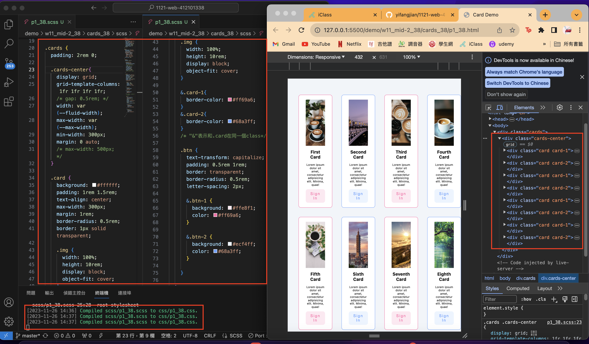
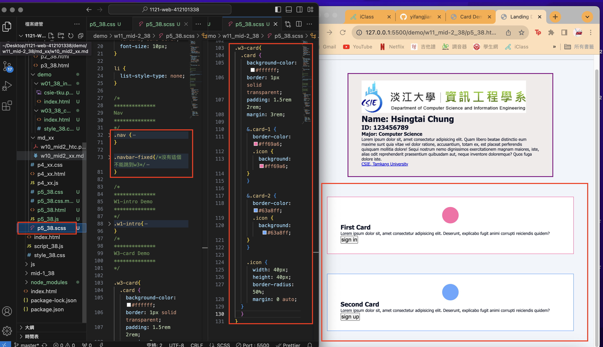
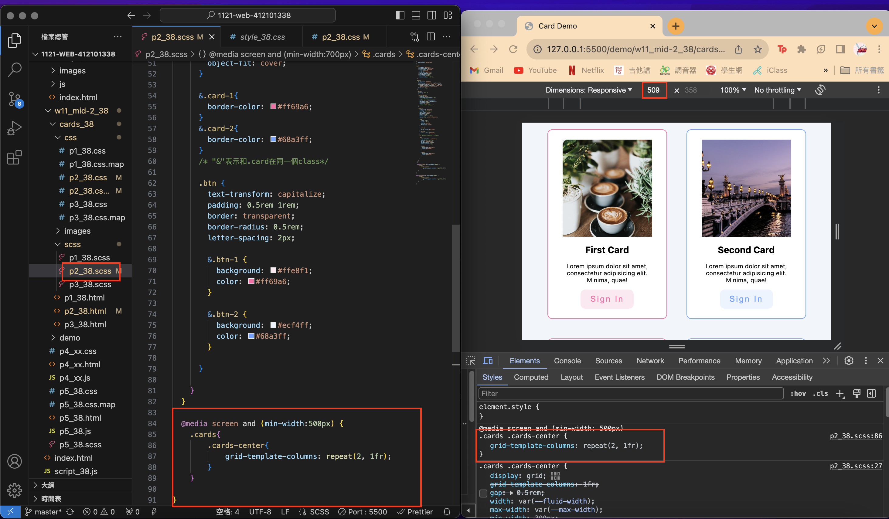
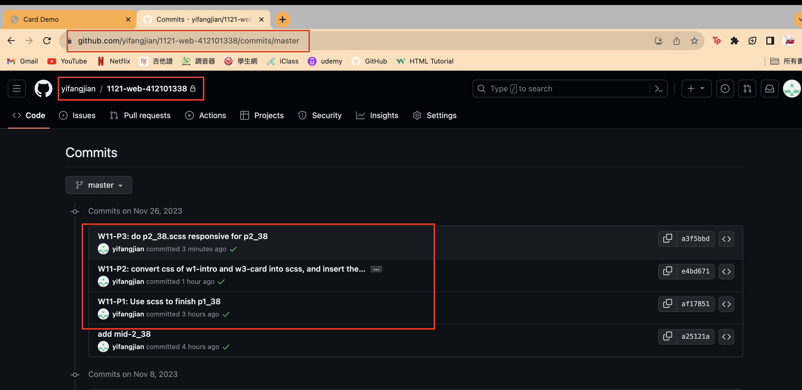

[My Github Repo](https://github.com/yifangjian/1121-web-412101338)

### W11-P1: Use scss to finish p1_38



``` 
af17851 yifangjian      Sun Nov 26 14:58:36 2023 +0800  W11-P1: Use scss to finish p1_38

```

### W11-P2: convert css of w1-intro and w3-card into scss, and insert them into p5_38.scss



```
e4bd671 yifangjian      Sun Nov 26 17:23:22 2023 +0800  W11-P2: convert css of w1-intro and w3-card into scss, and insert them into p5_38.scss
```

###### W11-P3: do p2_38.scss responsive for p2_38



```
a3f5bbd yifangjian      Sun Nov 26 18:15:35 2023 +0800  W11-P3: do p2_38.scss responsive for p2_38
```

### W11-P4: W11 git logs



```
git log --pretty=format:"%h%x09%an%x09%ad%x09%s" --after="2023-11-25"
a3f5bbd yifangjian      Sun Nov 26 18:15:35 2023 +0800  W11-P3: do p2_38.scss responsive for p2_38
e4bd671 yifangjian      Sun Nov 26 17:23:22 2023 +0800  W11-P2: convert css of w1-intro and w3-card into scss, and insert them into p5_38.scss
af17851 yifangjian      Sun Nov 26 14:58:36 2023 +0800  W11-P1: Use scss to finish p1_38
a25121a yifangjian      Sun Nov 26 13:35:19 2023 +0800  add mid-2_38
```