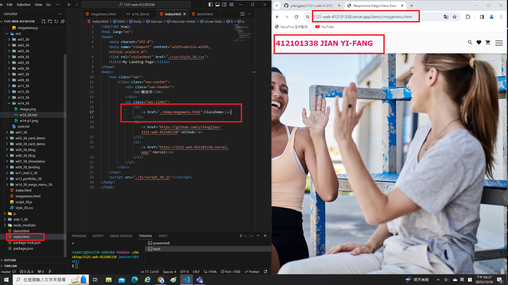
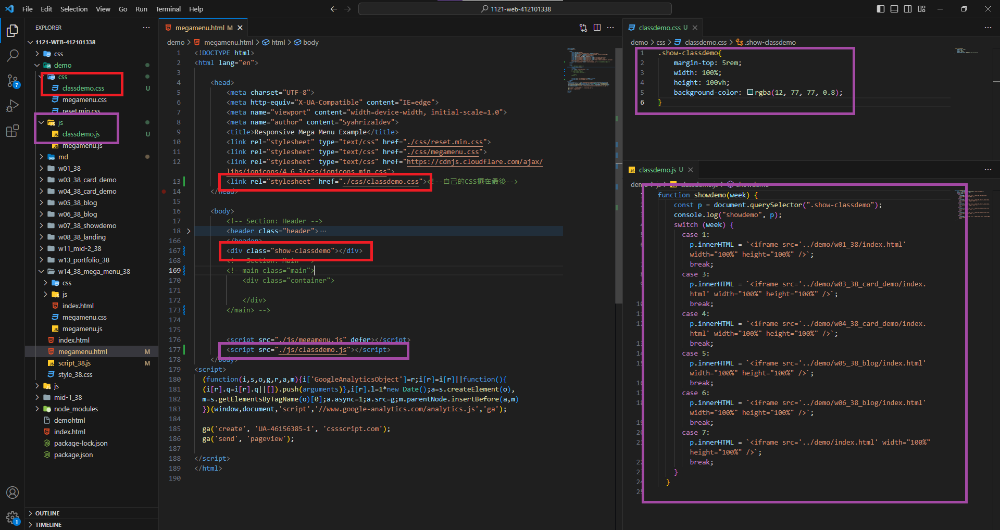
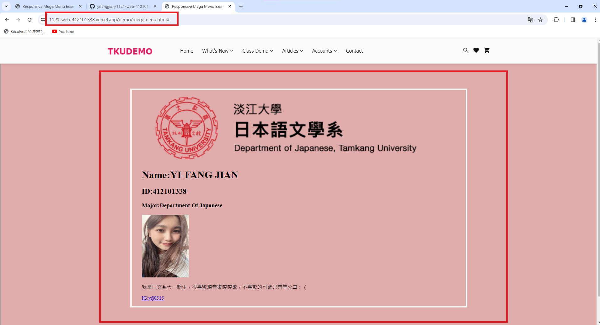
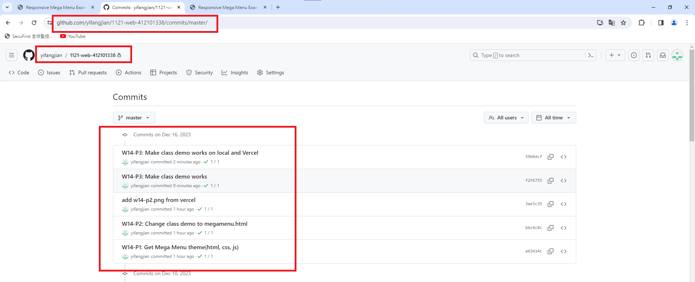

[My Github Repo](https://github.com/yifangjian/1121-web-412101338)

### W14-P1: Get Mega Menu theme(html, css, js)


```
a63d14c yifangjian      Sat Dec 16 15:58:44 2023 +0800  W14-P1: Get Mega Menu theme(html, css, js)
```

### W14-P2: Change class demo to megamenu.html



```
bbc4c8c yifangjian      Sat Dec 16 16:20:48 2023 +0800  W14-P2: Change class demo to megamenu.html
```

### W14-P3: Make class demo works on local and Vercel

##### => local




##### => Vercel



```
59b6dcf yifangjian      Sat Dec 16 17:39:03 2023 +0800  W14-P3: Make class demo works on local and Vercel
```

### W14-P4: W14 git logs



```
$  git log --pretty=format:"%h%x09%an%x09%ad%x09%s" --after="2023-12-15"
59b6dcf yifangjian      Sat Dec 16 17:39:03 2023 +0800  W14-P3: Make class demo works on local and Vercel
f2f6755 yifangjian      Sat Dec 16 17:31:45 2023 +0800  W14-P3: Make class demo works
3ae3c35 yifangjian      Sat Dec 16 16:30:21 2023 +0800  add w14-p2.png from vercel
bbc4c8c yifangjian      Sat Dec 16 16:20:48 2023 +0800  W14-P2: Change class demo to megamenu.html
a63d14c yifangjian      Sat Dec 16 15:58:44 2023 +0800  W14-P1: Get Mega Menu theme(html, css, js)
```
