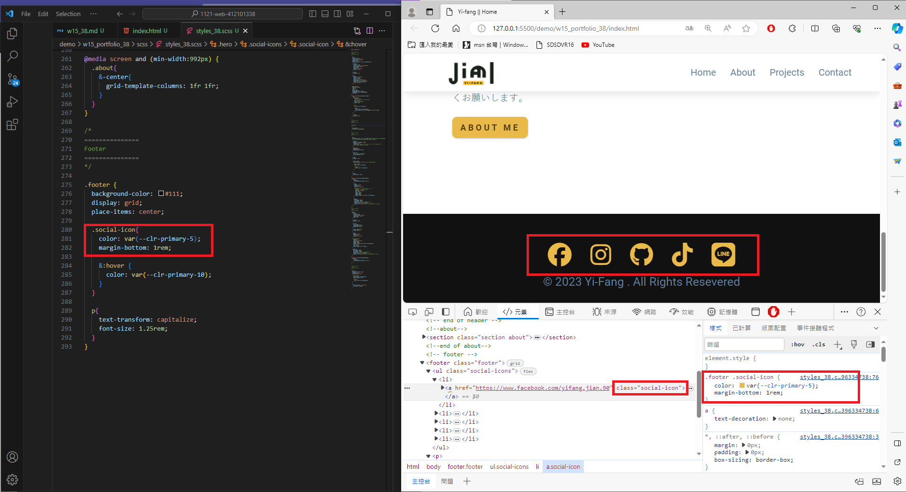
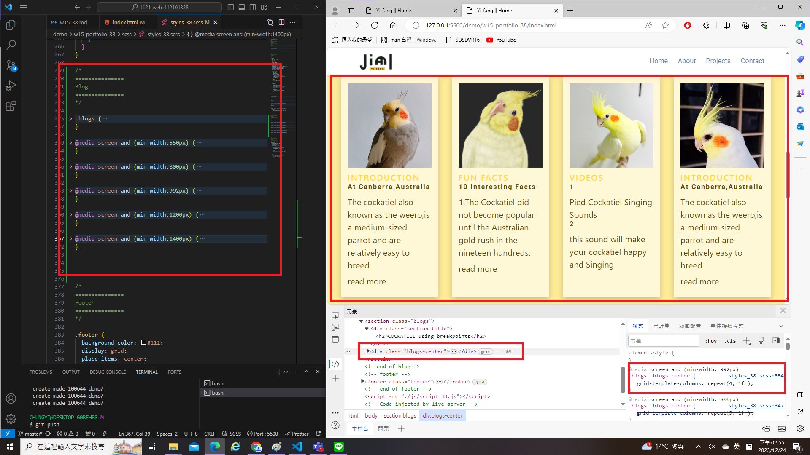
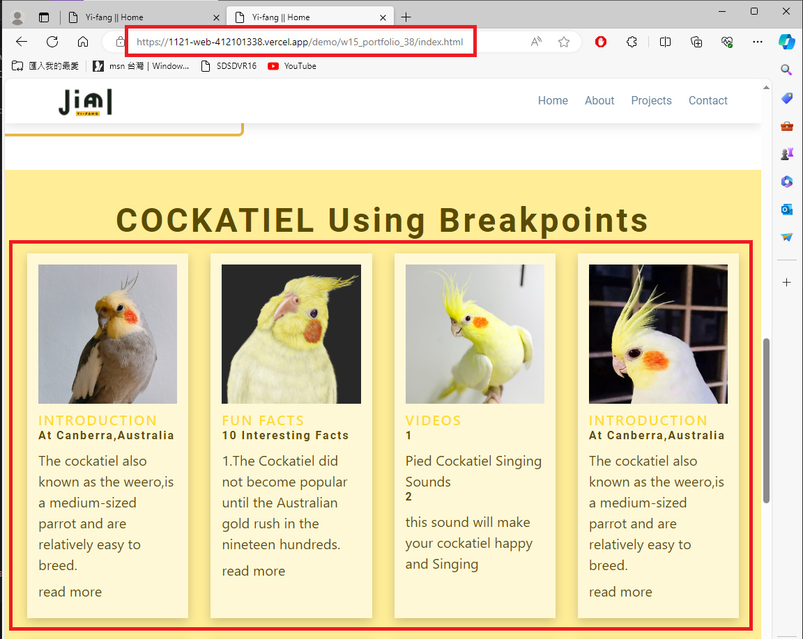
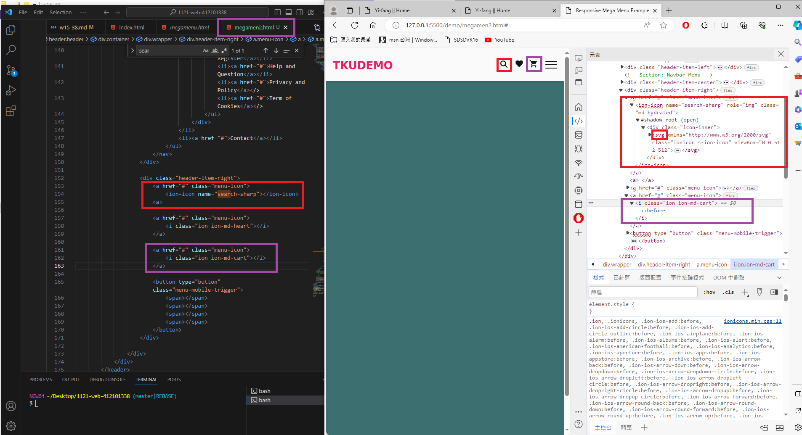
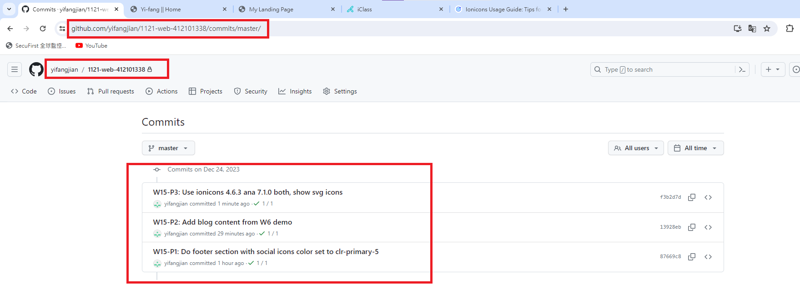

[My Github Repo](https://github.com/yifangjian/1121-web-412101338)


### W15-P1: Do footer section with social icons color set to clr-primary-5
 


```
87669c8 yifangjian      Sun Dec 24 13:47:37 2023 +0800  W15-P1: Do footer section with social icons color set to clr-primary-5
```

### W15-P2: Add blog content from W6 demo
 
#### => local
 

 
#### => Vercel


 
```
13928eb yifangjian      Sun Dec 24 15:03:04 2023 +0800  W15-P2: Add blog content from W6 demo
```

### W15-P3: Use ionicons 4.6.3 ana 7.1.0 both, show svg icons
 

 
```
f3b2d7d yifangjian      Sun Dec 24 15:31:12 2023 +0800  W15-P3: Use ionicons 4.6.3 ana 7.1.0 both, show svg icons
```

### W15-P4: git logs of Week 15
 

 
```

```
 
 
 