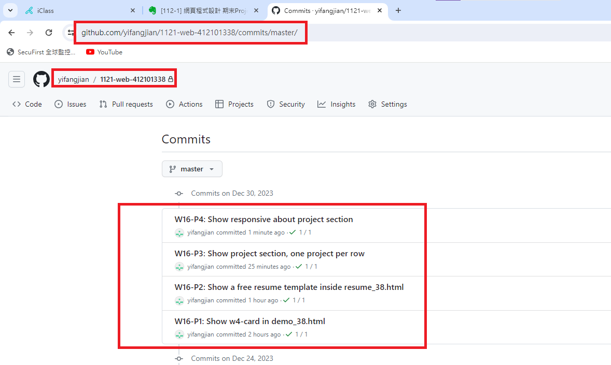

[My Github Repo](https://github.com/yifangjian/1121-web-412101338)


### W16-P1: Show w4-card in demo_38.html
 

 

```
a2db006 yifangjian      Sat Dec 30 14:22:21 2023 +0800  W16-P1: Show w4-card in demo_38.html
```

### W16-P2: Show a free resume template inside resume_38.html
 

 
```
3ee0180 yifangjian      Sat Dec 30 15:37:01 2023 +0800  W16-P2: Show a free resume template inside resume_38.html
```

### W16-P3: Show project section, one project per row
 

 
```
98cca6c yifangjian      Sat Dec 30 16:20:34 2023 +0800  W16-P3: Show project section, one project per row
```

### W16-P4: Show responsive about project section
 

 

```
28cb674 yifangjian      Sat Dec 30 16:44:36 2023 +0800  W16-P4: Show responsive about project section
```

### W16-P5: git logs of Week 16
 

 
```
$  git log --pretty=format:"%h%x09%an%x09%ad%x09%s" --after="2023-12-29"
28cb674 yifangjian      Sat Dec 30 16:44:36 2023 +0800  W16-P4: Show responsive about project section
98cca6c yifangjian      Sat Dec 30 16:20:34 2023 +0800  W16-P3: Show project section, one project per row
3ee0180 yifangjian      Sat Dec 30 15:37:01 2023 +0800  W16-P2: Show a free resume template inside resume_38.html
a2db006 yifangjian      Sat Dec 30 14:22:21 2023 +0800  W16-P1: Show w4-card in demo_38.html
```
 
 
 